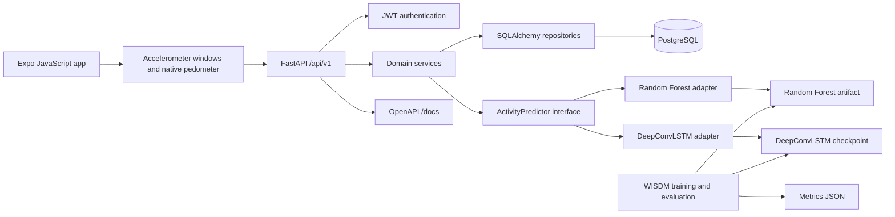
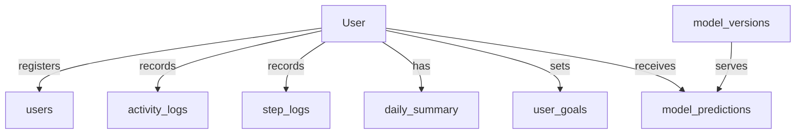

# System Architecture

The mobile app captures 200 accelerometer samples at 20 Hz, converts Expo's acceleration-in-g units to m/s², and submits a window. The server derives a fixed feature vector and calls an `ActivityPredictor`; requests and responses use activity labels and sensor windows, not estimator-specific types. A future XGBoost or temporal neural adapter can implement the same interface. Native device pedometer readings are uploaded as idempotent daily totals separately from activity classification.
The mobile app captures 200 accelerometer samples at 20 Hz, converts Expo's acceleration-in-g units to m/s², and submits a window. The server passes that sequence to the configured `ActivityPredictor`; requests and responses use activity labels and sensor windows, not estimator-specific types. `ACTIVITY_MODEL=auto` selects the evaluated DeepConvLSTM checkpoint when present and falls back to Random Forest otherwise. Native device pedometer readings are uploaded as idempotent daily totals separately from activity classification.

PostgreSQL stores user, event, model version, prediction, goal, and daily aggregate records. Repositories own access patterns; services own aggregation and model behavior; API routers handle HTTP semantics and validation. Daily summaries are refreshed on step updates and predictions. FastAPI's generated OpenAPI contract is the API documentation source.

